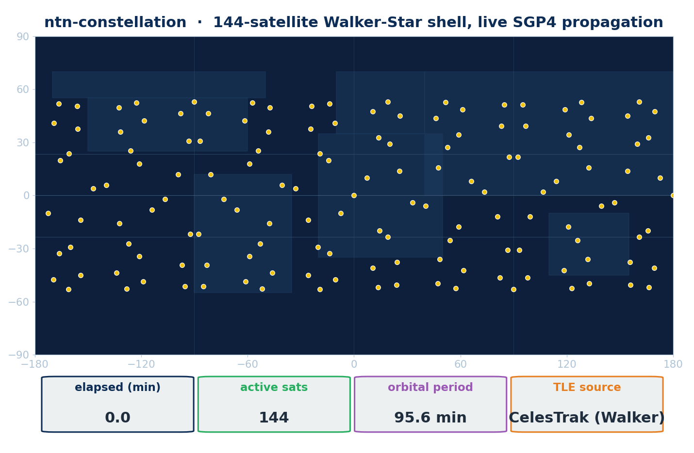

# ntn-constellation

> Walker constellation generation, orbital propagation, contact-graph scheduling/routing, and a TR 38.821 + Starlink calibration corpus for ns-3 6G NTN research. Part of **ns3-ntn-toolkit** — [README](https://github.com/Muhammaduazir69/ns3-ntn-toolkit) / [INSTALL](INSTALL.md).

<p align="center">
  <a href="https://www.nsnam.org"></a>
  <a href="https://www.gnu.org/licenses/old-licenses/gpl-2.0.en.html"></a>
  
  
  
  
</p>

<p align="center">
  
</p>

## Overview

`ntn-constellation` provides the orbital-mechanics foundation for the toolkit: it
generates LEO constellations, propagates them with high fidelity inside an ns-3
simulation, and turns the resulting time-varying geometry into the link-up/link-down
events that the rest of the data plane consumes. Everything lives in the
`ns3::ntncon` namespace.

- **Walker-Delta / Walker-Star generator** — `WalkerConstellation::BuildDelta()` /
  `BuildStar()` build a full constellation from a `WalkerConfig` (planes,
  satellites per plane, altitude, inclination), emitting classical orbital
  elements ready for the mobility model.
- **Orbital propagation** — `Sgp4MobilityModel` is an ns-3 `MobilityModel` that
  propagates a satellite from a `TleRecord` (or `KeplerianElements`) using an
  analytic Kepler propagator with secular J2 corrections (RAAN and
  argument-of-perigee) and an SGP4-compatible TLE interface, so position queries
  during `Simulator::Run()` follow the orbit. ECEF/ECI/geodetic surfaces and a
  ground-station elevation query are built in. Full Vallado SGP4 (with
  atmospheric drag / B*) is planned for Q4 2026; the TLE drag (B*) field is
  parsed but not yet used by this model.
- **Contact-graph scheduling** — `ContactGraphScheduler` evaluates GSL (ground↔sat)
  and ISL (sat↔sat) visibility over the simulation timeline and raises
  `ContactEvent`s as links come up and go down.
- **Contact-graph path computation** — `ContactGraphRouter` is a path-computation
  helper (inherits `Object`): it computes paths across the time-varying topology
  and returns node-ID sequences — direct contacts, BFS shortest path,
  edge-weighted Dijkstra, and a regenerative-vs-bent-pipe mode (`SetRegenMode`)
  that steers the computed path around bent-pipe transit nodes. It installs **no
  ns-3 forwarding table**; the routed examples feed the computed path to ns-3
  static/global routing themselves.
- **Calibration corpus** — `tr38821-corpus` (`Tr38821CorpusReader`,
  `CalibrationHarness`) ships 3GPP TR 38.821 reference scenarios/link budgets plus
  a Starlink-EU latency/station corpus to validate toolkit predictions against
  published references.

This module also ships a pip-installable Python companion (`ntn_constellation`) for
the tool side — see [Python package](#python-package).

**Two propagators, two fidelity levels.** The in-simulation C++ model
(`Sgp4MobilityModel`) is a **Kepler + J2 secular propagator with a
TLE-compatible interface** — it is *not* a full SGP4 implementation yet; full
Vallado SGP4 (atmospheric drag / B*) is planned for Q4 2026, and the B* field
is parsed but unused until then. The
tool-side Python package (`ntn_constellation`) is different: it uses the real
`sgp4` library and Skyfield for canonical SGP4/SDP4 propagation when it generates
TLEs, ephemerides, and export files offline. So "SGP4" claims below apply to the
Python side; the C++ side is Kepler+J2 for now.

## What's new

See [CHANGELOG.md](CHANGELOG.md) for this module's changelog.

- **Measured radio in the access-link examples.** `ntn-constellation-walker-traffic`
  and `ntn-constellation-sgp4-mobility-traffic` now drive a **real mmwave NR NTN
  cell** through `NtnRealStackHelper` (from the `ntn-traffic` module): SpectrumPhy +
  MAC + HARQ + RLC/PDCP + RRC + EPC, with SINR/TBLER/throughput **measured off the
  mmwave PHY traces** — no closed-form SINR, no P2P star. Ground UEs use TR 38.811
  mobility classes (`NtnTr38811MobilityHelper`, from `ntn-cho`).
- **Measured application KPIs in the routed examples.** The
  `ntn-constellation-isl-routed-traffic` and `ntn-constellation-real-routed`
  examples carry traffic with `NtnOranApplication` / `NtnOranSink` (from
  `ntn-traffic`): every packet carries a 24-byte in-band `NtnOranPayloadHeader`
  (5QI, S-NSSAI, QFI, sequence, TX timestamp), and one-way delay, RFC 3550
  jitter, and loss are **measured at the sink** from those header primitives.
  `OnOffApplication` traffic is gone toolkit-wide.
- **Real orbital dynamics in the routed examples.** Satellites in the routed
  examples are SGP4/Walker neighbours projected into a local ENU frame
  (`NtnEnuProjectionMobilityModel`, from `ntn-cho`), so the satA-sets / satB-rises
  reroute emerges from genuine orbital motion.

## Models, helpers & key classes

Derived from `model/*.h`:

| Header | Key types | Role |
|---|---|---|
| `walker-constellation.h` | `WalkerConfig`, `WalkerConstellation` (`BuildDelta`, `BuildStar`) | Walker-Delta / Walker-Star constellation generation (planes, sats/plane, altitude, inclination). |
| `sgp4-mobility-model.h` | `Sgp4MobilityModel` | ns-3 `MobilityModel` that propagates a satellite during the simulation via an analytic Kepler + secular-J2 propagator with an SGP4-compatible TLE interface (full Vallado SGP4 with drag/B* planned Q4 2026; B* parsed but unused). ECEF/ECI/geodetic accessors and `GetElevationDeg()`. |
| `orbital-elements.h` | `TleRecord`, `KeplerianElements` | TLE / Keplerian element records consumed by the mobility model. |
| `contact-graph-scheduler.h` | `ContactGraphScheduler`, `ContactEvent` | Computes GSL/ISL visibility and emits link up/down events over time; up/down event counters per link class. |
| `contact-graph-router.h` | `ContactGraphRouter` | Path-computation helper over the time-varying contact graph (returns node-ID vectors; installs no forwarding table): BFS shortest path, weighted Dijkstra, regenerative-vs-bent-pipe constrained path selection. |
| `tr38821-corpus.h` | `Tr38821CorpusReader`, `Tr38821Scenario`, `Tr38821LinkBudget`, `StarlinkLatencySample`, `StarlinkStation`, `CalibrationResidual` | TR 38.821 + Starlink calibration corpus and harness. |

## Examples

Built binaries land in `build/contrib/ntn-constellation/examples/` as
`ns3.43-<NAME>-default`. Each can be launched through `./ns3 run` (from the repo
root) or invoked directly. The two access-link examples (`walker-traffic`,
`sgp4-mobility-traffic`) require the toolkit's `mmwave` module; the two routed
examples need only core ns-3 plus `ntn-traffic`/`ntn-cho`.

### ntn-constellation-walker-traffic

A Walker-Delta constellation provides the ephemeris and ISL/GSL contact-graph
context (`ContactGraphScheduler`), while ONE serving satellite carries a real
mmwave NR NTN cell (`NtnRealStackHelper`) to TR 38.811 ground UEs placed at its
sub-point. Radio KPIs (SINR/TBLER/throughput) are measured off the mmwave PHY
trace; constellation-scale connectivity is reported from the contact graph.

```bash
# via ns3 (from repo root)
./ns3 run "ntn-constellation-walker-traffic --simSeconds=20 --numPlanes=4 --satsPerPlane=11 --altKm=550 --inclinationDeg=53 --outputDir=results/walker"
```

**Outputs:** `sim_health.csv` (measured-KPI fidelity gates) in `--outputDir`, plus
a summary block printed to stdout:

```
# === ntn-constellation-walker-traffic summary ===
#   Walker: planes=<P> sats/plane=<S> total=<N> altKm=<A> inc=<I> deg
#   serving cell on sat 0 (sub-point lat <..> lon <..>)
#   measured SINR=<..> dB  measured throughput=<..> Mbps
#   GSL up=<N> down=<N>  ISL up=<N> down=<N>
```

**Key args:** `--simSeconds`, `--numPlanes`, `--satsPerPlane`, `--altKm`,
`--inclinationDeg`, `--islRangeCapKm`, `--numUes`, `--satEirpDbm`, `--outputDir`.

### ntn-constellation-sgp4-mobility-traffic

A single LEO satellite from a TLE drives a real mmwave NR NTN cell
(`NtnRealStackHelper`) toward TR 38.811 ground UEs, while the
`ContactGraphScheduler` tracks GSL up/down events from the live orbital geometry.
If `--gsLat`/`--gsLon` are not supplied, the ground station is auto-placed beneath
the satellite's t=0 sub-point so a real rise→zenith→set pass always occurs
regardless of TLE epoch.

```bash
# via ns3 (from repo root)
./ns3 run "ntn-constellation-sgp4-mobility-traffic --simSeconds=20 --tle=contrib/ntn-rrc/data/iss-zarya.tle --outputDir=results/sgp4"

# pin a fixed ground site
./ns3 run "ntn-constellation-sgp4-mobility-traffic --simSeconds=20 --gsLat=33.6844 --gsLon=73.0479 --minElev=10 --outputDir=results/sgp4"
```

**Outputs:** `sim_health.csv` in `--outputDir`, plus a summary block printed to
stdout:

```
# === ntn-constellation-sgp4-mobility-traffic summary ===
#   TLE: <path>   GS(lat,lon)=(..)  minElev=<..> deg
#   measured SINR=<..> dB  measured throughput=<..> Mbps  GSL up=<N> down=<N>
```

**Key args:** `--simSeconds`, `--tle` (default: `contrib/ntn-rrc/data/iss-zarya.tle`),
`--gsLat` / `--gsLon` (default: satellite t=0 sub-point), `--minElev`, `--numUes`,
`--satEirpDbm`, `--outputDir`.

### ntn-constellation-isl-routed-traffic

Real ISL-routed packet forwarding `GS1 -> satA -> [ISL] -> satB -> GS2`: real Ipv4
forwarding through the satellite nodes, per-hop propagation delay set to the real
slant/ISL range over c, and a binary geometry contact gate per hop (GSL above
minimum elevation, ISL within the range cap) — when a hop falls out of contact its
link drops and delivery recovers when contact resumes. Traffic is an
`NtnOranApplication` CBR flow; delivery/delay/jitter/loss are measured end-to-end
at the `NtnOranSink` from the in-band `NtnOranPayloadHeader`.

```bash
./ns3 run "ntn-constellation-isl-routed-traffic --duration=40"
```

**Outputs:** `sim_health.csv` (throughput, mean e2e delay, jitter, loss, delivery
ratio, out-of-contact ticks — each tagged with its measurement provenance) in
`--outputDir`, plus a measured summary on stdout.

**Key args:** `--duration`, `--altKm`, `--satSpeed`, `--minElev`,
`--islRangeCapKm`, `--outputDir`.

### ntn-constellation-real-routed

Routing-pattern flagship: the geometry-driven routing decision actually INSTALLS
Ipv4 static routes, so real UDP packets are forwarded through the satellite nodes
and adaptively REROUTE as the constellation moves — `gs1 -> satA -> gs2` while
satA is in contact, then `gs1 -> satB -> gs2` once satA sets and satB rises (the
two satellites are real Kepler+J2-secular Walker neighbours — Vallado SGP4
available via `SetUseVallado` — projected into a local ENU frame).
Per-link delay is the real slant range over c; KPIs are measured at the
`NtnOranSink`.

```bash
./ns3 run "ntn-constellation-real-routed --duration=40"
```

**Outputs:** `sim_health.csv` (throughput, delay, jitter, loss, route installs,
reroute count) in `--outputDir`, plus per-event `ROUTE INSTALLED via satA/satB`
lines and a measured summary on stdout.

**Key args:** `--duration`, `--altKm`, `--satSpeed`, `--outputDir`.

## Python package

This module also ships a pip-installable Python companion, `ntn_constellation` —
a pure-Python, tool-side pipeline for **fresh ephemerides**, **canonical SGP4/SDP4
propagation**, and **export shapes** that drop into both the simulator (SNS3 scenario
layout) and the CesiumJS 3D viewer. It does not modify the C++ ns-3 build; it
produces inputs the simulator already understands.

- Built-in presets: **Starlink** (shells 1+2 + polar) · **OneWeb** · **Kuiper** ·
  **Telesat Lightspeed** · **Iridium NEXT**.
- Walker generators (`walker_delta`, `walker_star`) emitting valid SGP4-parseable TLEs.
- `Satellite` / `Constellation` API over Skyfield + raw `sgp4`; geodetic subpoint,
  ECI state vector, ground-station elevation/azimuth/range.
- ISL topology builders (`build_isl_topology` k-NN with range cap;
  `grid_isl_topology_walker` closed-form +grid for Walker layouts).
- Live feeds: CelesTrak (no credentials) and Space-Track
  (`SPACETRACK_USER`/`SPACETRACK_PASS`), with a TTL-based on-disk TLE cache (default 6 h).
- Exporters: `write_sns3_scenario` (SNS3 `positions/{tles,isls,start_date,gw_positions,ut_positions}.txt`)
  and `write_czml` (CesiumJS CZML).
- `ntn-fetch` CLI entry point for one-line scenario builds (preset or live).

Install and run:

```bash
git clone https://github.com/Muhammaduazir69/ntn-constellation.git contrib/ntn-constellation
cd contrib/ntn-constellation
python3 -m venv .venv
.venv/bin/pip install -e .[test]
```

```bash
# Live: current Starlink → SNS3 + Cesium
.venv/bin/ntn-fetch starlink --out data/starlink-now \
    --max-sats 200 --czml --czml-duration-min 120 --czml-step-sec 30 -v

# Preset (no internet): Kuiper Phase-1 Walker
.venv/bin/ntn-fetch kuiper --out data/kuiper --isl-walker --czml
```

```python
from datetime import datetime, timedelta, timezone
from ntn_constellation import (
    CelesTrakFeed, TleCache, Constellation,
    build_isl_topology, write_sns3_scenario, write_czml,
)

feed = CelesTrakFeed(cache=TleCache("./.cache"))
tles = feed.fetch_group("oneweb")[:100]

c = Constellation.from_tles(tles)
when = datetime.now(tz=timezone.utc)

visible = c.visible_from(when, observer_lat_deg=33.6844,
                         observer_lon_deg=73.0479, min_elevation_deg=10)
isls = build_isl_topology(c, when, k_nearest=4, max_range_km=5000.0)
write_sns3_scenario(scenario_dir="data/oneweb-sample", tles=tles,
                    start_date=when, isls=isls)
write_czml(constellation=c, start=when, duration=timedelta(hours=2),
           sample_step=timedelta(seconds=30),
           out_path="data/oneweb-sample/oneweb.czml")
```

The Python side ships 10 unit tests (TLE parsing, preset generation, SGP4
propagation, ISS visibility from Islamabad, ISL topology, SNS3 file layout) and is
validated against an independent Skyfield reference (24 h / 66 sats / 1440 samples:
0 NaN, 0.4 s wallclock; STARLINK-1008 1800 s pass: max 23.5 µs error, drift
0.006 µs/s). See [INSTALL.md](INSTALL.md) for the full Python setup including
CelesTrak/Space-Track environment variables.

## Build, run & test

From the repository root:

```bash
# Configure & build
./ns3 configure --enable-examples --enable-tests
./ns3 build

# Run an example
./ns3 run "ntn-constellation-real-routed --duration=40"

# Run this module's test suite
./test.py --suite=ntn-constellation
```

The `ntn-constellation` suite has 20 unit tests covering TLE parsing/checksums,
periodic-return and ECEF-altitude propagation checks, Walker-Delta geometry,
contact scheduling (LEO pass + same-plane ISL pair), contact-graph routing
(direct edges, BFS, weighted Dijkstra, regenerative-only routing — including
600 s `Simulator::Run()` cases), and the TR 38.821 + Starlink calibration
harness. The constellation mobility models are additionally cross-validated
against Kepler orbital theory, the Doppler envelope, and TR 38.821 geometry by
the toolkit's standards-validation campaign (in `ntn-cho`'s test suite).

For prerequisites and per-module setup, see [INSTALL.md](INSTALL.md). For the full
toolkit build, see the [toolkit repository](https://github.com/Muhammaduazir69/ns3-ntn-toolkit).

## License & author

GPL-2.0-only — see [LICENSE](LICENSE).

**Muhammad Uzair**, Independent Researcher.

```bibtex
@misc{uzair2026ntnconstellation,
  author = {Uzair, Muhammad},
  title  = {ntn-constellation: Walker Constellation Generation, SGP4 Propagation,
            Contact-Graph Scheduling/Routing and a TR 38.821 Calibration Corpus
            for 6G NTN Research},
  year   = {2026},
  url    = {https://github.com/Muhammaduazir69/ntn-constellation}
}
```

## Acknowledgements

Brandon Rhodes (`sgp4`, Skyfield) · CelesTrak (Dr. T. S. Kelso) · Space-Track / 18th
Space Defense Squadron · CesiumJS · pytroll (`pyorbital`) · ns-3 core team · SNS3
maintainers.
